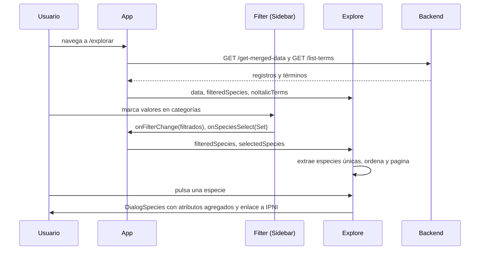
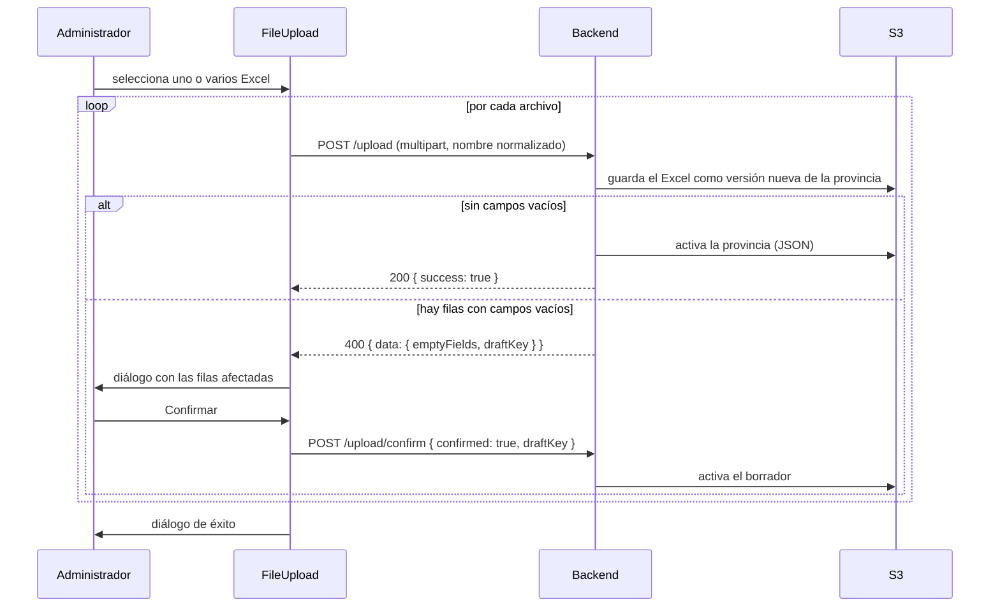

# 01. Arquitectura

## Estructura de carpetas

```
sigmetum-frontend/
├── public/                  # index.html, favicon, manifest, robots.txt
├── src/
│   ├── index.js             # Punto de entrada: ErrorBoundary > BrowserRouter > App
│   ├── App.js               # Layout, rutas y estado global de datos
│   ├── i18n.js              # Configuración de i18next (ES por defecto, EN)
│   ├── index.css            # Directivas de Tailwind y tipografías base
│   ├── App.css              # Solo .App { text-align: center }
│   ├── config/
│   │   ├── env.js           # Lectura centralizada de variables VITE_*
│   │   └── assets.js        # Claves de S3 de los recursos estáticos y assetUrl()
│   ├── services/
│   │   └── api.js           # Cliente HTTP único (fetch + envoltorio { success, data })
│   ├── hooks/
│   │   └── useDialog.js     # Estado de los diálogos de aviso/confirmación
│   ├── utilities/           # Funciones puras y hooks auxiliares
│   ├── languages/{es,en}/translation.json
│   ├── pages/               # Una por ruta (10)
│   └── components/          # Componentes reutilizables (34)
├── tailwind.config.js       # Fuentes Amaranth (primary) y Sen (secondary)
├── .env.example             # Plantilla de variables de entorno
└── .claude/                 # Plugins y skills de Claude Code compartidos
```

## Arranque

[src/index.js](../src/index.js) monta la aplicación en `#root` con este árbol:

```
<ErrorBoundary>          ← captura cualquier error de render y muestra "Algo salió mal"
  <BrowserRouter>        ← enrutado por History API
    <App />
```

Antes del render se importa `./i18n`, que inicializa i18next con detección automática del idioma del navegador.

## Layout

`App` pinta siempre la misma estructura:

```
┌──────────────────────── Header (fijo, h-16) ─────────────────────────┐
│ Logo + SIGMETUM-A      LanguageSwitcher                  Navbar      │
├──────────┬───────────────────────────────────────────────────────────┤
│ Sidebar  │  <main>  ← <Routes> (página activa)                        │
│ (solo en │                                                           │
│ rutas de │                                                           │
│ datos)   │                                                           │
├──────────┴───────────────────────────────────────────────────────────┤
│ Footer (enlaces + copyright)                             "V 1.0.0"   │
└──────────────────────────────────────────────────────────────────────┘
CookieBanner (fijo abajo, hasta que se acepta)
```

La barra lateral aparece solo en `/explorar`, `/cargar-archivos`, `/administrar-datos` y `/administrar-contenido`.

## Rutas

| Ruta | Página | Acceso | Descripción |
|---|---|---|---|
| `/` | `Home` | Pública | Portada, universidades y entidades colaboradoras, formulario de contacto |
| `/explorar` | `Explore` | Pública | Listado paginado de especies características con filtros |
| `/galeria` | `VegetationGallery` | Pública | Galería de fotos de vegetación |
| `/sobre-nosotros` | `About` | Pública | Propósito, misión y valores del proyecto |
| `/cookies` | `Cookies` | Pública | Política de cookies |
| `/login` | `Login` | Pública | Acceso de administradores |
| `/cargar-archivos` | `FilesUpload` | **Protegida** | Subida de Excel de datos por provincia |
| `/administrar-datos` | `DataManagement` | **Protegida** | Consulta, descarga, activación y borrado de versiones |
| `/administrar-contenido` | `ContentManagement` | **Protegida** | Términos no latinos e imágenes de la galería |
| `*` | `NotFound` | Pública | Página 404 |

Las rutas protegidas se envuelven en `<ProtectedRoute element={...} />`, que valida el token contra `GET /auth` y comprueba su caducidad (ver [05-componentes.md](05-componentes.md#protectedroute)).

## Estado global y flujo de datos

No hay Redux ni Context: el estado de datos compartido vive en `App` y se pasa por props.

| Estado en `App` | Tipo | Uso |
|---|---|---|
| `mergedData` | `Array<Registro> \| null` | Todos los registros de todas las provincias (`GET /get-merged-data`). Fuente del explorador |
| `filteredSpecies` | `Array<Registro>` | Resultado de aplicar los filtros a `mergedData` |
| `selectedSpecies` | `Set<string> \| undefined` | Especies marcadas en el filtro "Especies Características" |
| `noItalicTerms` | `Array<{ term }>` | Términos que no se escriben en cursiva (`GET /list-terms`) |
| `selectedData` | `Array<Registro>` | Registros de la versión elegida en "Administrar datos" |
| `filteredData` | `Array<Registro>` | `selectedData` tras aplicar filtros |
| `isLoading`, `exploreError` | `boolean` | Carga y error del explorador |
| `eeVisible` | `boolean` | Mensaje oculto al pulsar "V 1.0.0" en el pie |

Un **registro** es una fila del Excel convertida a JSON por el backend. Las claves son los nombres de columna en español (`Provincia`, `Municipio`, `Altitud Media`, `Sector Biogeográfico`, `Piso Bioclimático`, `Ombrotipo`, `Naturaleza del Sustrato`, `Tipo de Serie`, `Serie de Vegetación`, `Vegetación Potencial`, `Especies Características`, `image`...). Algunos valores son arrays, como `Especies Características`.

### Ciclo de vida según la ruta

El `useEffect` de `App` sobre `location.pathname`:

- **`/explorar`**: activa el spinner, limpia filtros y selección y descarga en paralelo `get-merged-data` y `list-terms`. Al terminar, quita el spinner.
- **`/administrar-datos`**: vacía `selectedData` y `filteredData`. Los datos se cargan cuando el usuario elige una versión en `FileDropdown`.
- **Cualquier otra ruta**: libera `mergedData` y todos los filtros para no mantener en memoria el conjunto completo.

En todos los casos hace `window.scrollTo(0, 0)`.

### Flujo del explorador



### Flujo de subida de datos (API v2)



Al cancelar (botón "Cancelar" o clic fuera del diálogo), el frontend envía `confirmed: false` para que el backend borre el borrador y detiene la cola de subida. Antes de la corrección A1 no lo hacía (ver [09](09-estado-actual-y-deuda-tecnica.md)).

## Autenticación

1. `LoginForm` envía `POST /log { username, password }` y guarda `data.token` en `localStorage['token']`.
2. Las llamadas protegidas añaden `Authorization: Bearer <token>` (`api.getAuth`, `postAuth`, `postFormAuth`, `deleteAuth`).
3. `ProtectedRoute` valida el token con `GET /auth` al montar cada ruta protegida. Si ha caducado, muestra un aviso, borra el token y redirige a `/login`.
4. No hay cierre de sesión explícito: el token dura lo que decida el backend.

## Recursos estáticos

Logos, banner, imagen de "Sobre nosotros" y glosario PDF se sirven directamente desde S3 o CloudFront con URL pública: `assetUrl(clave) = VITE_S3_URL + '/' + clave`. Las imágenes de la galería llegan como URLs prefirmadas desde `GET /list-images`.
